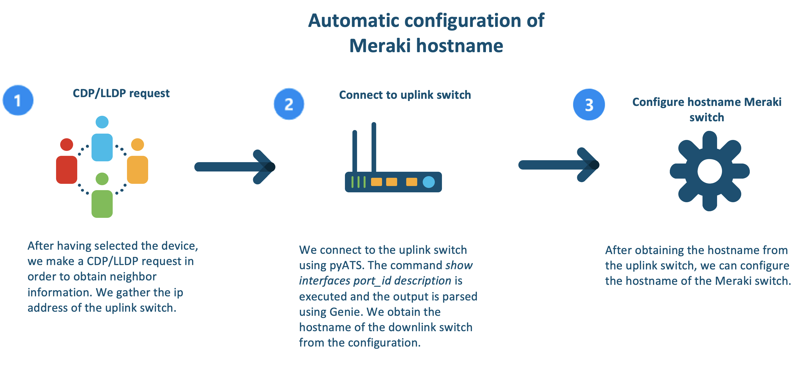
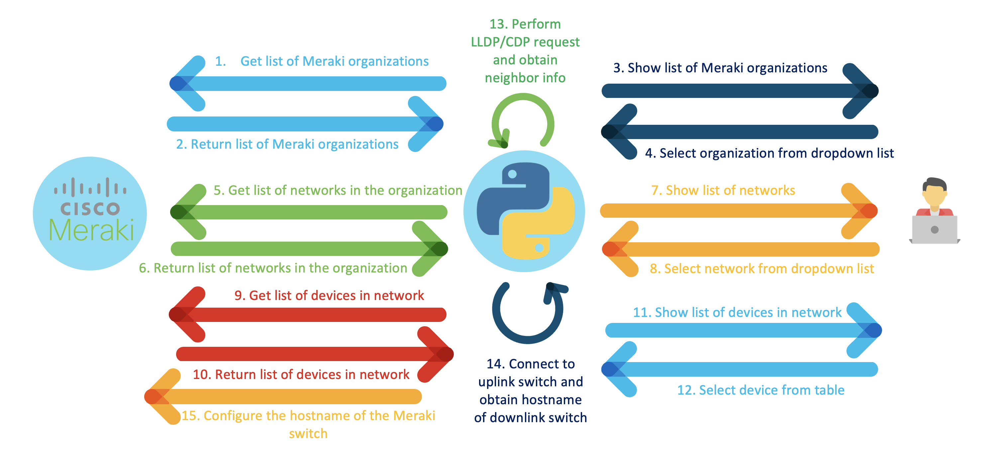
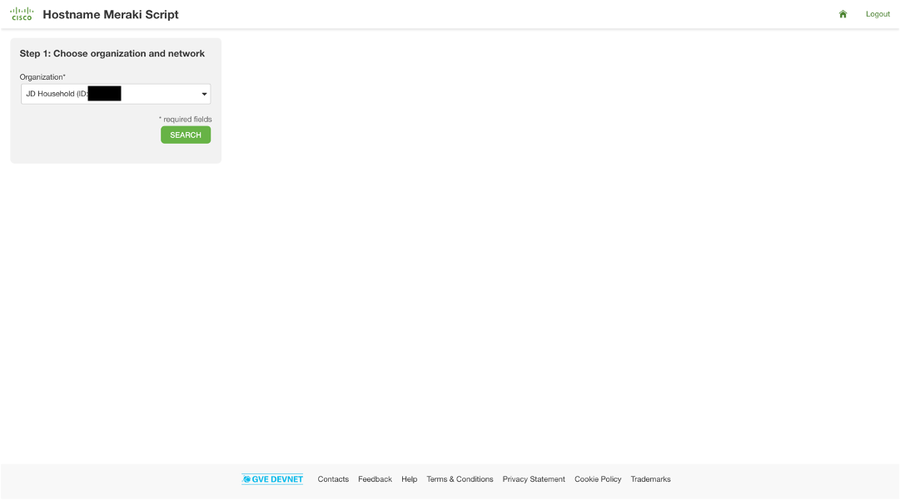
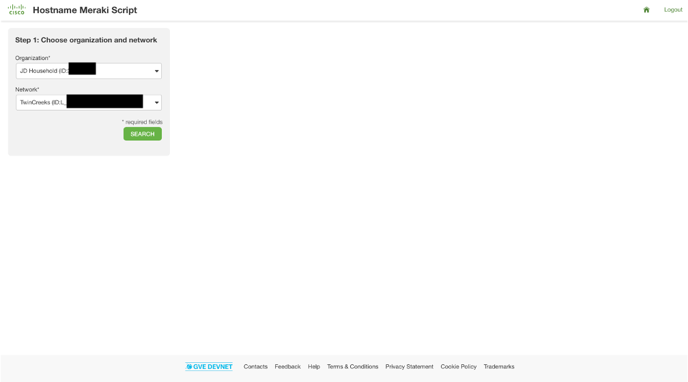
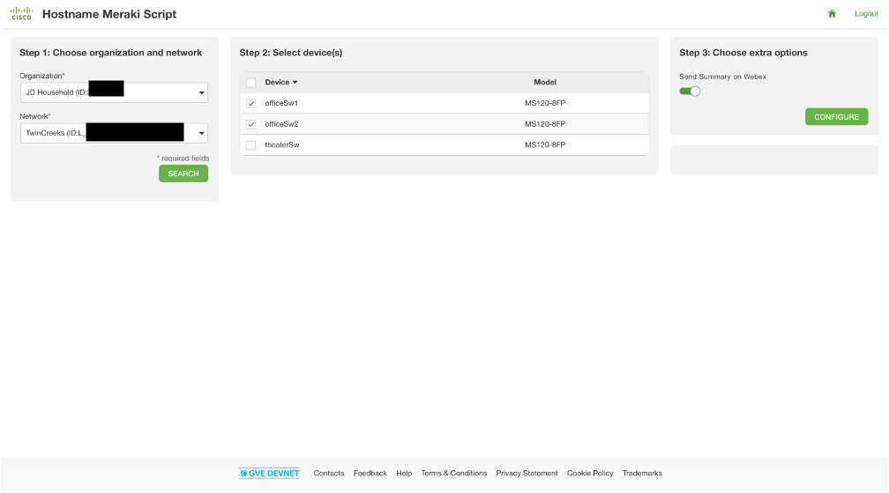
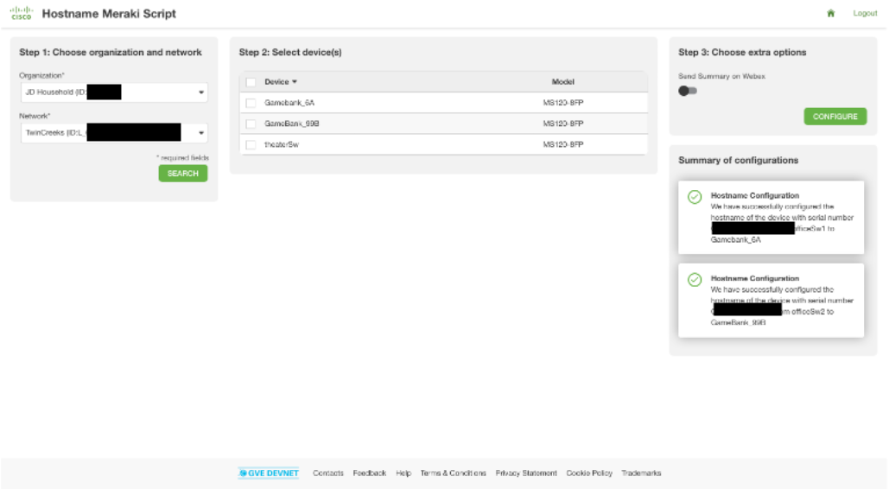

# GVE DevNet PyATS Hostname App
An application that can configure the hostname of a Meraki device by obtaining neighbor information through CDP/LLDP and it parses output from the neighboring device using Genie/PyATS.

## Contacts
* Simon Fang (sifang@cisco.com)

## Solution Components
* PyATS
* Flask
* Python
* Cisco Meraki
    - [API Documentation](https://developer.cisco.com/meraki/api-v1/)
* Webex Teams SDK

## Meraki API Key

In order to use the Cisco Meraki API, you have to enable the API for your organization first. After having enabled API access, you can generate an API key. You can follow the following instructions on how to enable API access and how to generate an API key:

1. Log in to the Cisco Meraki dashboard

2. In the left-hand menu, go to `Organization > Settings > Dasbhoard API access`

3. Click on `Enable access to the Cisco Meraki Dashboard API`

4. Go to `Profile > API access`

5. Under `API access`, click on `Generate API key`

6. Save the API key in a safe place. Please note that the API key will be shown only once for security purposes. In case you lose the key, then you have to revoke the key and regenerate a new key. Moreover, there is a limit of only two API keys per profile. 

> For more information on how to generate an API key, please click here [here](https://documentation.meraki.com/General_Administration/Other_Topics/Cisco_Meraki_Dashboard_API)

> Note: Make sure this API key has write access to both the source and target organization. You can add your account as Full Organization Admin to both organizations by following the instructions [here](https://documentation.meraki.com/General_Administration/Managing_Dashboard_Access/Managing_Dashboard_Administrators_and_Permissions).

## Webex Bot

In order to send notifications to a Webex space, we have created a Webex Bot. Follow the following instructions to create a Webex bot and its token: 

1. Log in to `developer.webex.com`

2. Click on your avatar and select `My Webex Apps`

3. Click `Create a New App`

4. Click `Create a Bot` to start the wizard

5. Following the instructions of the wizard: fill in details such as the bot name, bot username and choose an icon

6. Click `Add Bot` and you will be given access token

7. Copy the access token and store it safely. Please note that the API key will be shown only once for security purposes. In case you lose the key, then you have to revoke the key and regenerate a new key

> For more information about Webex Bots and how to create one, please see the [documentation](https://developer.webex.com/docs/bots).

## Webex Room ID

You have to specify the Room ID of the Webex space and you have to add the Webex Bot to the room space as well. 

In order to obtain the Room ID, you have to make a GET request to the following endpoint: 

> https://api.ciscospark.com/v1/rooms

The response will be a list of JSON objects, which are the spaces that the user is part of. Find the space that you would like to send the notifications to and copy the Room ID. 

> For more information about how to obtain a Webex Room ID, please consult the following resource [here](https://developer.cisco.com/site/webex-101/). 

## Genie/pyATS

In order to use pyATS, we have to create a testbed file, which contains the information on how to connect to the devices. The testbed file will include include the following elements:

* IP address
* Port
* Credentials
* Protocol (SSH, Telnet)
* Type of device

An example testbed file has been provided in ```testbed_example.yaml```. If you want to read more on how to create a testbed file, then consult the documentation in the following link: 

> https://pubhub.devnetcloud.com/media/pyats-getting-started/docs/quickstart/manageconnections.html#creating-testbed-yaml-file

In order to parse CLI output, we use a parser called Genie. Genie integrates well with pyATS and it is agnostic by design. You can consult the documentation through the following link: 

> https://developer.cisco.com/docs/genie-docs/

## Flow




## Installation

1. Clone the repository:

        $ git clone <link>

2. (optional) Create a virtual environment and activate it (find instructions [here](https://docs.python.org/3/tutorial/venv.html))

3. Update the `env_var.py` file. Note that the `config` variable is a Python dictionary:

    ```python
    config = {}

    config['x_cisco_meraki_api_key'] = ""
    config['webex_teams_acces_token'] = ""
    config['webex_room_id'] = ""
    config['device_name_filter'] = ""
    config['device_username'] = ""
    config['device_password'] = ""
    config['port_number_to_uplink_switch'] = ""
    ```

    * `x_cisco_meraki_api_key` is the Meraki API key. In the section above is explained how to generate this key. 
    * `webex_teams_acces_token` is the Webex Bot token. In the section above is explained how to generate this token. 
    * `webex_room_id` is the Room ID of the space that you would like to send the messages to. In the section above is explained how to obtain this ID. 
    * `device_name_filter` is the device name that you would to target. For example, in this PoV, we target the models starting with `MS120-8`.
    * `device_username` is the username of the uplink switch.  
    * `device_password` is the password of the uplink switch.  
    * `port_number_to_uplink_switch` is the port number on the Meraki/downlink device. The port is connected to the uplink switch. In this PoV, the uplink switch is always connected to port number 9 to the downlink switch. 

4. In a terminal, install the requirements with `pip install -r requirements.txt`. 


## Usage
1. Run the flask application:

        $ python app.py

2. Go to the following url:

        https://localhost:5000/


# Screenshots






### LICENSE

Provided under Cisco Sample Code License, for details see [LICENSE](LICENSE.md)

### CODE_OF_CONDUCT

Our code of conduct is available [here](CODE_OF_CONDUCT.md)

### CONTRIBUTING

See our contributing guidelines [here](CONTRIBUTING.md)

#### DISCLAIMER:
<b>Please note:</b> This script is meant for demo purposes only. All tools/ scripts in this repo are released for use "AS IS" without any warranties of any kind, including, but not limited to their installation, use, or performance. Any use of these scripts and tools is at your own risk. There is no guarantee that they have been through thorough testing in a comparable environment and we are not responsible for any damage or data loss incurred with their use.
You are responsible for reviewing and testing any scripts you run thoroughly before use in any non-testing environment.